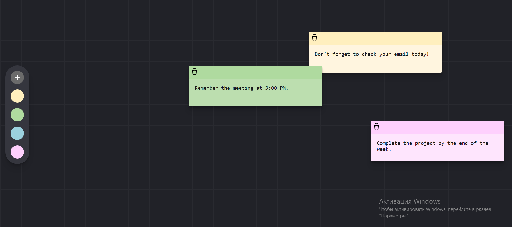

# Sticky-notes-app

## Overview
Simple note-taking app built with React and using Appwrite for data storage. Users can create, delete, and edit notes, drag them around the screen, and change their colors to keep things organized.



[Live Preview](https://ptimer.github.io/sticky_notes/)

## Installation

To set up the project, navigate to the root folder and run the following command to install dependencies:

```bash
npm install
```

## Usage

After installing dependencies, start the server using the following command:

```bash
npm run dev
```